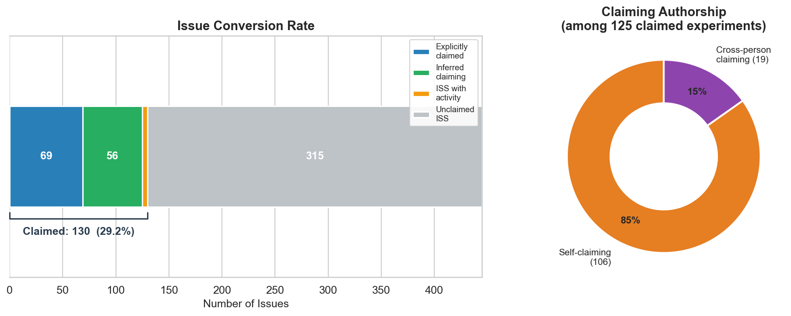

# EVD 1 — Issue Conversion Rate

### 18% of MATSUlab issues were claimed as experiments, and 36% of those produced at least one formal result node

---

## Figure

**Figure 1. 18% of issues (69 of 389) were claimed as experiments; 72% of claims were self-claims and 28% were cross-person idea exchanges.** (Left) Stacked horizontal bar showing the composition of all 389 issues: unclaimed ISS pages (grey, n=320) and claimed experiments (blue, n=69). (Right) Donut chart showing claim authorship: self-claims where the issue creator and claimer were the same person (orange, n=50, 72%) vs. cross-person claims where a different researcher claimed the issue (purple, n=19, 28%).

> An [interactive HTML version](fig1_conversion_rate.html) is also included (download and open locally).

---

## Evidence description

The issue conversion rate was computed across all identifiable issues in the MATSUlab Roam Research discourse graph. Issues were identified as either formal ISS (Issue) nodes (n=320) or experiment pages (n=69), giving a total of 389 issues. An experiment page is identified by a title starting with `@` followed by a type prefix (e.g., `@analysis/...`, `@experiment/...`).

An issue was considered "claimed" if it had been converted to an experiment page — detected via a `Claimed By::` metadata field (explicit claim) or the presence of experimental log entries authored by the page creator (inferred claim). This yielded 69 claimed experiments out of 389 total issues (17.7%).

Of the 69 claimed experiments, 25 (36%) had at least one linked RES (Result) node, representing experiments that produced a formally recorded result. The 25 result-producing experiments generated a total of 44 RES nodes, averaging 1.8 results per experiment. The remaining 44 claimed experiments either have work still in progress or recorded their outputs in formats other than formal `[[RES]]` pages.

Among the 69 experiment-page claims with known creator–claimer pairs, 72% (50) were self-claims and 28% (19) were cross-person claims where the issue creator and claimer were different people.

## Summary

The issue conversion rate measures how many research questions (Issues) in the lab's discourse graph progressed to active work (Experiments) and formal outputs (Results).

| Stage | Count | Rate |
|-------|------:|-----:|
| Total issues | 389 | — |
| Claimed as experiments | 69 | 18% of issues |
| Produced at least one result | 25 | 36% of claimed |
| Total RES nodes produced | 44 | 1.8 per experiment |

Among the 69 claimed experiments:
- **50 (72%)** were self-claims — the same person who created the issue also worked on it
- **19 (28%)** were cross-person claims — a different researcher picked up the issue, representing **idea exchange** between lab members

## Grounding context

The MATSUlab discourse graph uses the [Discourse Graph](https://discoursegraph.com) framework in Roam Research. Researchers create **ISS** (Issue) nodes to articulate research questions, then claim them as **experiments** (`@analysis/...` or `@experiment/...` pages) by adding a `Claimed By::` field or by starting an experimental log. Results are recorded as **RES** nodes that reference the parent experiment.

Readers should be aware of the following when interpreting the numbers above:

- **Claim detection is metadata-dependent.** Claiming was assessed via the `Claimed By::` page attribute, page authorship, or authorship of dated log entries within experiment pages. Issues that were informally transferred between researchers — without updating the metadata — are not captured.
- **Inferred claims default to self-claims.** When no `Claimed By::` field is present, the claim is attributed to the page creator. Cross-person transfers that happened without updating the metadata are therefore counted as self-claims, likely **underestimating** the true idea exchange rate.
- **Issue count depends on naming conventions.** The 389 total issues comprise formal `[[ISS]]` pages plus experiment pages identified by the `@analysis/` or `@experiment/` prefix. Research questions articulated in other formats (e.g. daily notes, meeting notes) are not counted.
- **Result linking uses a three-tier fallback.** RES nodes are matched to experiments via (1) explicit JSON-LD relation instances, (2) backreferences in RES titles, or (3) substring matching on experiment descriptions (≥20 characters). Results stored informally — in daily notes, figures without RES pages, or external tools — are not captured. The 36% result rate is therefore a lower bound.
- **Snapshot date.** All counts reflect a single February 2026 export. Work in progress at the time of export is counted as "no result yet."

## Methods

Claim detection: [`src/calculate_metrics.py`](../../../src/calculate_metrics.py)
Visualization: [`src/generate_visualizations.py`](../../../src/generate_visualizations.py)
Full pipeline trace: [`notebooks/evd1_evd7_analysis.ipynb`](../../../notebooks/evd1_evd7_analysis.ipynb)

See [`methods_excerpt.md`](methods_excerpt.md) for detailed methodology.

## Data

- [`data/conversion_data.json`](data/conversion_data.json) — Aggregated conversion rates, claim type breakdown, and result statistics

## Metadata

- [`evidence.jsonld`](evidence.jsonld) — Canonical JSON-LD metadata (evidence statement, observable, method, provenance)
- [`ro-crate-metadata.json`](ro-crate-metadata.json) — RO-Crate 1.1 manifest

## Source material

Contact [The Discourse Graphs Project](mailto:discoursegraphsATgmailDOTcom) for read access to the following source material:
- [Experimental log](https://roamresearch.com/#/app/discourse-graphs/page/E5UYzWC6b)
- Raw data: MATSUlab graph in JSON-LD and JSON

## Attribution

- **Analysis and evidence bundles:** [Matt Akamatsu](https://orcid.org/0000-0002-0286-5310) and [Claude](https://claude.ai) (Anthropic)
- **Discourse graph system:** [Discourse Graphs Project](https://discoursegraphs.com/), [Joel Chan](https://orcid.org/0000-0003-3000-4160), [Matt Akamatsu](https://orcid.org/0000-0002-0286-5310)
- **Lab discourse graph data:** [Akamatsu Lab](https://matsulab.org), University of Washington
- **Discourse Graph extension:** [DiscourseGraphs](https://github.com/DiscourseGraphs/discourse-graph)

## License

[CC-BY-4.0](https://creativecommons.org/licenses/by/4.0/)
