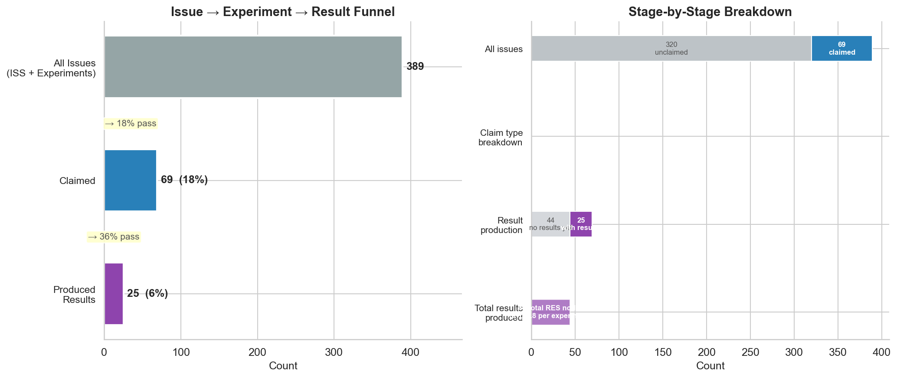

# EVD 5 — Issue-to-Experiment-to-Result Flow

### 69 of 389 issues were claimed as experiments; 25 produced formal results, with cross-person idea exchange accounting for 28% of all claims

---

## Figure

**Figure 5. Of 389 issues, 69 were claimed as experiments with 25 subsequent results.** Alluvial (Sankey) diagram showing all 69 claimed experiments flowing through three stages: Issue Created (left), Issue Claimed (center), and Result Created (right). Band width is proportional to the number of experiments. Green bands indicate self-claims; purple bands indicate cross-person claims (idea exchange). Researcher names are anonymized (R1–R11); the PI (Matt Akamatsu) is identified.

> An [interactive HTML version](fig5_alluvial_flow.html) allows hovering to inspect individual flows (download and open locally).

### Supplemental

**Supplemental Figure. Progressive attrition from 389 issues to 69 claimed experiments (18%) to 25 with formal results (36% of claimed).** Right panel shows composition at each stage.

---

## Summary

This evidence bundle traces the full lifecycle of research questions in the MATSUlab discourse graph — from issue creation through experiment claiming to formal result production — and reveals who is involved at each stage.

### Conversion funnel

| Stage | Count | Rate |
|-------|------:|-----:|
| Total issues | 389 | — |
| Claimed as experiments | 69 | 18% of issues |
| Produced formal results | 25 | 36% of claimed |
| Total RES nodes | 44 | 1.8 avg per experiment |

### Idea exchange

| Flow type | Count | Rate |
|-----------|------:|-----:|
| Self-claims (same person) | 50 | 72% |
| Cross-person claims | 19 | 28% |

The 19 cross-person claims represent **idea exchange** — cases where a researcher picked up an issue created by someone else. The alluvial diagram reveals the specific pathways: which researchers create issues that others claim, and who ultimately produces the results.

### Key observations from the flow diagram

- **R1** created the most issues (30) and claimed the most experiments (32), with most being self-claims
- **Matt Akamatsu** created issues that were claimed by multiple different researchers, serving as a hub for idea distribution
- **44 of 69 claimed experiments** have not yet produced a formal RES node (shown as "No Result Yet" on the right), indicating work-in-progress or informal output recording
- Cross-person flows (purple bands) connect diverse researcher pairs, with Matt Akamatsu as the primary issue source for cross-person claims

## Grounding context

In the discourse graph system, the path from question to answer follows a structured workflow: **Issue (ISS)** → **Experiment** (someone claims the issue and begins work) → **Result (RES)** (formal result node linked back to the experiment). The alluvial diagram visualizes this three-stage flow at the researcher level.

This bundle shares the same underlying metrics pipeline as EVD 1. Readers should be aware of the following when interpreting the flow diagram:

- **Claim detection is metadata-dependent.** Claiming was assessed via the `Claimed By::` page attribute, page authorship, or authorship of dated log entries within experiment pages. Issues informally transferred between researchers — without updating the metadata — are not captured.
- **Inferred claims default to self-claims.** When no `Claimed By::` field is present, the claim is attributed to the page creator, likely **underestimating** cross-person idea exchange.
- **Attribution priority chain.** When multiple metadata fields exist (`Made By::`, `Claimed By::`, `Author::`, JSON-LD creator), the pipeline uses the first available in that order. If fields disagree about who created or claimed the issue, only the highest-priority field is used.
- **"No Result Yet" is ambiguous.** 44 of 69 claimed experiments show no linked RES node. This could mean work is in progress, results were recorded informally, or the experiment was abandoned. The diagram does not distinguish between these cases.
- **Cross-person flows require known authorship on both sides.** If either the issue creator or the claimer is unknown, that experiment is excluded from the self-claim / cross-person classification (but still counted in the total). This may further underestimate cross-person exchange.
- **Flows reflect formal metadata, not informal collaboration.** A researcher who contributed ideas, code review, or analysis support but is not listed in the `Claimed By::` or `Made By::` fields will not appear in the diagram.

## Methods

Metrics pipeline: [`src/calculate_metrics.py`](../../../src/calculate_metrics.py)
Alluvial diagram: [`src/handoff_visualizations.py`](../../../src/handoff_visualizations.py)
Funnel chart: [`src/generate_visualizations.py`](../../../src/generate_visualizations.py)
Bundle generator: [`src/create_evidence_bundle.py`](../../../src/create_evidence_bundle.py)
Full pipeline trace: [`notebooks/evd1_evd7_analysis.ipynb`](../../../notebooks/evd1_evd7_analysis.ipynb)

See [`docs/methods_excerpt.md`](docs/methods_excerpt.md) for detailed methodology covering node identification, claim detection, and RES linking.

## Data

- [`data/funnel_summary.json`](data/funnel_summary.json) — Aggregated funnel counts, conversion rates, and claim authorship breakdown
- [`data/experiment_details.csv`](data/experiment_details.csv) — Per-experiment rows with anonymized creator, claimer, claim type, timestamps, result counts, and time metrics (69 rows)

## Metadata

- [`evidence.jsonld`](evidence.jsonld) — Canonical JSON-LD metadata (evidence statement, observable, method, provenance)
- [`ro-crate-metadata.json`](ro-crate-metadata.json) — RO-Crate 1.1 manifest

## License

[CC-BY-4.0](https://creativecommons.org/licenses/by/4.0/)
