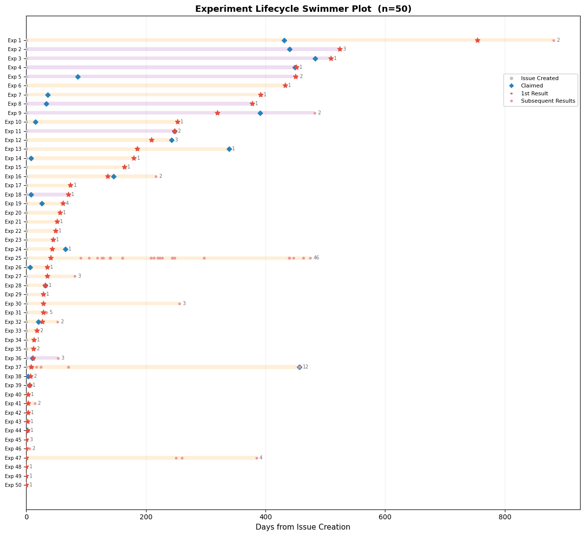

# EVD 6 — Time to Result

### Among 50 experiments in the MATSUlab that produced formal results, the median time from issue claiming to first result was 12 days, with wide variance (n=50, IQR 0–50 days)

---

## Figure

**Figure 6c. Among 50 experiments in the MATSUlab that produced formal results, the median time from issue claiming to first result was 12 days, with wide variance (n=50, IQR 0–50 days).** Each horizontal lane represents one experiment (n=50), sorted by time from issue creation to first result. Grey circle: issue creation (day 0). Blue diamond: date the experiment was claimed. Red star: first formal result (RES node). Light red circles: subsequent results. Orange background bars: self-claimed experiments. Purple background bars: cross-person claiming. The x-axis shows days from issue creation (page creation date), providing a unified timeline for all milestones.

> A [log-scale version](fig6c_swimmer_plot_log.png) and an [interactive HTML version](fig6c_swimmer_plot.html) with hover tooltips are also included.

---

## Summary Statistics

| Metric | n | Mean (days) | 95% CI | Median (days) | 95% CI | IQR |
|--------|--:|------------:|-------:|--------------:|-------:|----:|
| Issue creation → Claim | 125 | 52.8 | [33.2, 73.7] | 0 | [0, 0] | 0–28 |
| Issue creation → First result | 50 | 127.5 | [81.6, 179.6] | 38 | [23, 63] | 7–184 |
| Claim → First result | 50 | 47.6 | [10.7, 87.1] | 12 | [2, 31] | 0–50 |

*95% confidence intervals computed via 10,000 bootstrap resamples (percentile method).*

---

## Evidence description

Time-to-result metrics were computed for the 50 claimed experiments in the MATSUlab discourse graph that produced at least one formal RES (Result) node. All timing intervals were computed from actual timestamps:

- **Issue creation → Claim**: days from the page creation date (which represents when the issue was first articulated) to the date the experiment was claimed (via `Claimed By::` field or first experimental log entry).
- **Issue creation → First result**: days from page creation to the creation date of the earliest linked RES node.
- **Claim → First result**: days from the claim timestamp to the first RES node.

The distributions are heavily right-skewed. The median time from claiming to first result (12 days) is much shorter than the mean (47.6 days), driven by a long tail of experiments that took months to produce results. Six experiments (12%) produced a result on the same day they were claimed, while the longest took over 400 days.

The median time from issue creation to claiming was 0 days (n=125), reflecting that most experiments are claimed on the same day they are created. However, the mean (52.8 days) is pulled by a subset of issues that sat unclaimed for months before being picked up.

## Grounding context

Readers should be aware of the following when interpreting the numbers above:

- **Claim timing reflects metadata, not intent.** For explicitly claimed experiments, the claim date is when the `Claimed By::` block was created in Roam. For inferred claims (no `Claimed By::` field), the claim date is the first experimental log entry, which may post-date when the researcher actually began thinking about the problem.
- **Result timing reflects RES node creation, not discovery.** The result date is when the formal `[[RES]]` page was created, which may lag the actual moment of insight or completion of analysis. Some researchers write up results immediately; others batch them.
- **Negative claim-to-result intervals exist.** Seven experiments show negative claim-to-result days, where the RES node was created before the formal claim timestamp. This occurs when (a) the `Claimed By::` field was added retroactively after work was already underway, or (b) for inferred claims, the first log entry was written after the result. These cases are included in the statistics but visible in the swimmer plot.
- **Sample is conditioned on result production.** The 50 experiments analyzed here are those that produced at least one RES node. The 80 claimed experiments without results are not included. Time-to-result for the full population is right-censored (the Kaplan-Meier survival analysis in Fig 6f addresses this).
- **Unified x-axis correction.** An earlier version of the swimmer plot used mixed origins for claim vs. result markers (claim days from page creation, result days from claim timestamp for explicit claims). This was corrected so that all markers use page creation as day 0.
- **Snapshot date.** All timestamps reflect a February 2026 export of the MATSUlab discourse graph.

## Methods

Time-to-result calculation: [`src/calculate_metrics.py`](../../../src/calculate_metrics.py) — `calculate_time_to_first_result()`, `calculate_time_to_claim()`
Swimmer plot visualization: [`src/experiment_lifecycle_visualizations.py`](../../../src/experiment_lifecycle_visualizations.py) — `create_swimmer_plot()`, `_create_swimmer_plot_static()`
Full pipeline trace: [`notebooks/evd1_evd7_analysis.ipynb`](../../../notebooks/evd1_evd7_analysis.ipynb)

## Metadata

- [`evidence.jsonld`](evidence.jsonld) — Canonical JSON-LD metadata (evidence statement, observable, method, provenance)
- [`ro-crate-metadata.json`](ro-crate-metadata.json) — RO-Crate 1.1 manifest
- [`data/time_to_result_data.json`](data/time_to_result_data.json) — Summary statistics with bootstrap CIs, and per-experiment timing intervals (anonymized)

## Source material

Contact [The Discourse Graphs Project](mailto:discoursegraphsATgmailDOTcom) for read access to the following source material:
- [Experimental log](https://roamresearch.com/#/app/discourse-graphs/page/E5UYzWC6b)
- Raw data: MATSUlab graph in JSON-LD and JSON

## Attribution

- **Analysis and evidence bundles:** [Matt Akamatsu](https://orcid.org/0000-0002-0286-5310) and [Claude](https://claude.ai) (Anthropic)
- **Discourse graph system:** [Discourse Graphs Project](https://discoursegraphs.com/), [Joel Chan](https://orcid.org/0000-0003-3000-4160), [Matt Akamatsu](https://orcid.org/0000-0002-0286-5310)
- **Lab discourse graph data:** [Akamatsu Lab](https://matsulab.org), University of Washington
- **Discourse Graph extension:** [DiscourseGraphs](https://github.com/DiscourseGraphs/discourse-graph)

## License

[CC-BY-4.0](https://creativecommons.org/licenses/by/4.0/)
