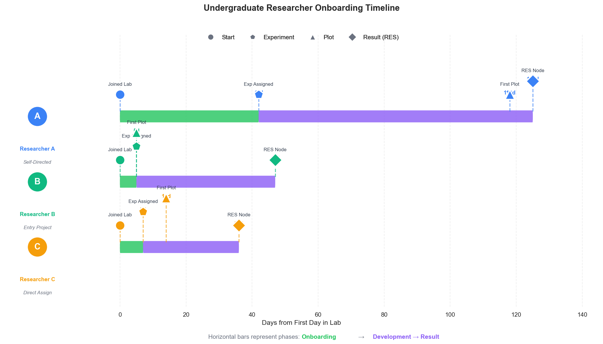

# EVD 7 — Undergraduate Researcher Onboarding Timeline

### All three undergraduate researchers produced a formal result within ~4 months, with two reaching their first result within ~1 month

---

## Figure

**Figure 7. Use of the issues board led to three undergraduate researchers producing results in 125, 47, and 36 days from start date.** Timeline showing the progression of three anonymized undergraduate researchers (A, B, C) from lab start to first formal result (RES node). Milestones tracked: first day in lab, first experiment, first plot, and first RES node. Numbers indicate days from lab start. Researcher A followed a self-directed exploration pathway (125 days to RES). Researcher B was assigned an entry project (47 days). Researcher C was directly assigned to an existing experiment (36 days).

> An [interactive HTML version](fig7_student_timelines.html) is also included (download and open locally).

---

## Summary

This evidence bundle quantifies how quickly undergraduate researchers produced formal results after joining the lab, comparing three different onboarding pathways through the discourse graph's issue board.

### Milestone timeline

| Researcher | Start date | Days to experiment | Days to plot | Days to RES | Pathway |
|:----------:|:----------:|-------------------:|-------------:|------------:|---------|
| **A** | Feb 23, 2024 | 42 | 118 | **125** | Self-directed exploration |
| **B** | Oct 10, 2024 | 5 | 5 | **47** | Assigned entry project |
| **C** | Jun 23, 2025 | 7 | 14 | **36** | Direct assignment |

### Comparison to lab average

| Metric | Undergrad mean | Lab average |
|--------|---------------:|------------:|
| Days to first RES | **69** | 88 |

All three undergraduates reached their first formal result faster than the lab-wide average of 88 days, suggesting that structured onboarding through the issue board accelerates early productivity.

### Onboarding pathways

**Researcher A — Self-directed exploration (125 days)**
Browsed the issue board independently and claimed an experiment matching their interests. Longest ramp-up time (42 days to first experiment), but produced a result autonomously with minimal direction.

**Researcher B — Assigned entry project (47 days)**
Was assigned a specific experiment designed to introduce the lab's simulation and analysis framework. Began producing plots within 5 days of starting. The structured entry point provided a clear on-ramp.

**Researcher C — Direct assignment (36 days)**
Was added as a contributor to an existing experiment via the `Possible Contributors::` field. Fastest time to result (36 days), benefiting from existing infrastructure and clear deliverables.

## Context

The MATSUlab discourse graph uses an **Issues board** — a shared collection of research questions (ISS nodes) that any lab member can browse and claim. This evidence bundle asks: how effectively does this system support new researcher onboarding?

Four milestones were tracked for each researcher:
1. **First day in lab** — extracted from daily notes
2. **First experiment** — first `[[@analysis/...]]` reference in daily notes or experiment page creation
3. **First plot** — first embedded image/visualization in daily notes
4. **First RES node** — formal result page creation in the discourse graph

## Methods

Timeline analysis: [`src/student_timeline_analysis.py`](../../../src/student_timeline_analysis.py)
Bundle generator: [`src/create_evidence_bundle.py`](../../../src/create_evidence_bundle.py)
Full pipeline trace: [`notebooks/evd1_evd7_analysis.ipynb`](../../../notebooks/evd1_evd7_analysis.ipynb)

See [`docs/evidence_statement.md`](docs/evidence_statement.md) for the full evidence description.

## Data

- [`data/student_milestones.json`](data/student_milestones.json) — Per-researcher milestone dates, days-from-start, and pathway classification

## Metadata

- [`evidence.jsonld`](evidence.jsonld) — Canonical JSON-LD metadata (evidence statement, observable, method, provenance)
- [`ro-crate-metadata.json`](ro-crate-metadata.json) — RO-Crate 1.1 manifest

## License

[CC-BY-4.0](https://creativecommons.org/licenses/by/4.0/)
